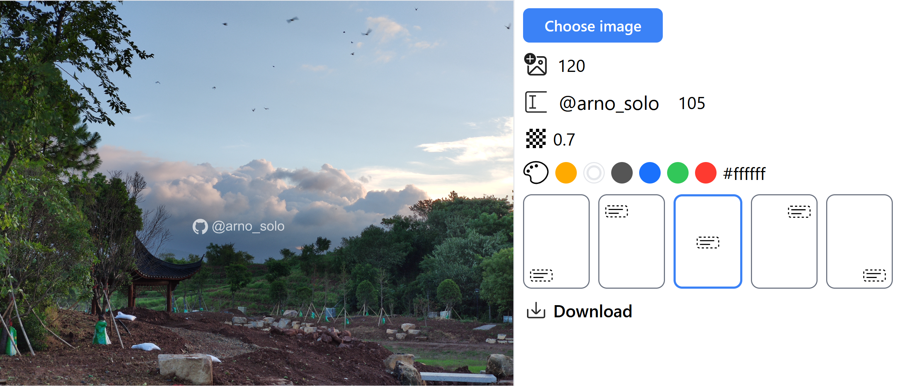

## Easy Watermark

#### issues

1. Hitting the download button does not provide any feedback

2. Try a grey background for the image area so you can actually see the text even when you don’t have an image selected

3. Line up the sliders

4. It's not perfect for mobile https://i.imgur.com/i787DFx.jpg (the top of the image is cut off).

5. dark theme

6. It would be nice to inform the user that the first two sliders are for sizing, so maybe add (px) unit after the number

7. You need to differentiate the Add icon and @your_name fields somehow. It’s not immediately obvious that you can interact with them.
